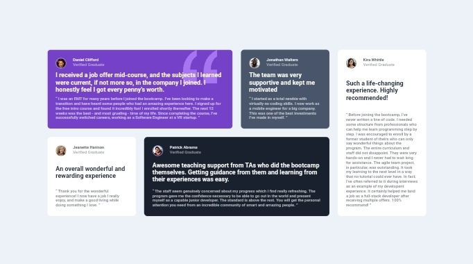

# Frontend Mentor - Testimonials grid section solution

This is a solution to the [Testimonials grid section challenge on Frontend Mentor](https://www.frontendmentor.io/challenges/testimonials-grid-section-Nnw6J7Un7). Frontend Mentor challenges help you improve your coding skills by building realistic projects. 

## Table of contents

- [Overview](#overview)
  - [The challenge](#the-challenge)
  - [Screenshot](#screenshot)
  - [Links](#links)
- [My process](#my-process)
  - [Built with](#built-with)
  - [What I learned](#what-i-learned)
  - [Continued development](#continued-development)
  - [Useful resources](#useful-resources)
- [Author](#author)
- [Acknowledgments](#acknowledgments)

## Overview

### The challenge

Users should be able to:

- View the optimal layout for the site depending on their device's screen size

### Screenshot

### Links

- Solution URL: [Solution](https://github.com/JohnNasSilva/Testimonials-grid-section.git)
- Live Site URL: [Live](https://johnnassilva.github.io/Testimonials-grid-section/)

## My process

### Built with

- Semantic HTML5 markup
- CSS custom properties
- Flexbox
- CSS Grid
- Mobile-first workflow

### What I learned

- grid
- grid-area
- grid-template
- grid-template-rows
- grid-template-columns
- grid-template-areas
- grid gap
- row-gap
- column-gap
- :first-child
- :nth-child()
- :last-child

### Continued development

### Useful resources

## Author

- Frontend Mentor - [@JohnNasci](https://www.frontendmentor.io/profile/JohnNasci)

## Acknowledgments
